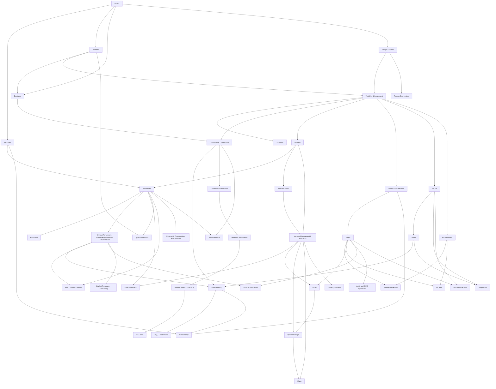

# Concept Roadmap

This document describes the draft for the Odin Track syllabus. It presents a reasonable list of concepts to be presented in the concept tree. As recommended in the [Exercism Syllabus Doc](https://exercism.org/docs/building/tracks/syllabus), the tree will be implemented incrementally and, in the process, the exact list of concepts may change. 

I looked at other tracks and, most of them, have between 35 and 45 concepts in their tree (with some going much higher - C-sharp has 62). Too many concepts may be intimidating to the student, too few may force us to bundle concepts that would better presented separately. The list below is mostly derived from the Go, Javascript, C++, C-sharp and Swift syllabus. Odin has a number of unique features which will be best addressed in their own unique concepts, for example "Memory Management and Allocators", "Structure of Arrays", "Matrix and SIMD Operations", etc. This increases the number of topics so, to try to keep the number in the 35-45 range, I bundled concepts which have been kept separate in other tracks where I thought they could be presented together. For example, I grouped integers and floating-point in a single topic (Number).

Some concepts are more important when getting started (core concepts) and other can be learned later. They may not even be needed in most of the practice exercises (advanced concepts).

I listed the concepts in the order they should be introduced, with pre-requisite concepts being located higher in the list. Advanced concepts are marked with a `(+)`. They should be developed after the core concepts. There are a couple of places where concepts have circular dependencies (like "Context" and "Memory Management & Allocator"). I picked an order for now but this may change once we start building the concept tree.

Also, because Odin is close to Go for most concepts (except interfaces/methods, garbage collection and goroutines), I was planning on borrowing heavily from the Go track concepts.

The goal is to have one exercise per concept. There may be exception if there is too much material to introduce in a single exercise, but in this case, we should consider splitting the concept into two smaller, more focused concepts.

## Overview

The diagram below provides an overview of the concepts and the order in which they should be addressed. Only the most important dependencies are shown here to try to keep the diagram legible. 

## Concepts (43)

There are currently 30 core concepts and 13 advanced concepts. Each section includes the concept name, slug, the concept `uuid`, and the list of Odin syntax elements that should be introduced.

### Basics

Present a getting-started program with the important parts explained. (Most of the tracks use a version of the lasagna exercise).
This will be a quick introduction and the concepts will be explained in greater details later.

This will also include a quick introduction to Odin comments (single-line, multiple-lines, multiple-lines nested, and documentation comments) since it isn't worth dedicating a special concept to the subject.

Syntax covered: `package`, `proc`, constants, numbers and arithmetic operations, assignment, `//`, `/* ... */`, `///`.

Aka: `basics`, `4db96bc0-433d-4a29-a1ec-45d37c86dd8d`

### Packages

Aka: `packages`, `79d17a9d-6758-40ac-947a-cbd699d8bc1e`

Explain Odin’s packages, their relation to a directory, how and where to import packages from. Explain that Exercism exercises are built with a Test Driven Development mindset. Each exercise is organized as a (small) library, not a full program with a `main()` entry point.

Syntax covered: `package`, `import`,`<package>.<proc>`, `"core:..."`.

### Numbers

Explain Odin’s integer and floating point types, their literals, and the limited auto-conversions. This will include a discussion of the arithmetic and bitwise operators.

Note: casting will have to be waved until we reach the Type Conversion concept.

Syntax covered: `i8`, `i16`, `i32`, `i64`, `i128`, `u8`, `u16`, `u32`, `u64`, `u128`, `int`, `uint`, `f16`, `f32`, `f64`, type size and machine architecture, integer literals (w/ base 2, 8, 16), floating-point literals, `+`, `-`, `~`, `*`, `/`, `%`, `%%`,
`|`, `&`, `&~`, `<<`, `>>`. compound operators (`+=`, ...).

Aka: `numbers`, `5e96a6b4-33dc-49d4-8f87-c1eaba0e3b49`

### Booleans

Explain Odin’s boolean type, including boolean literals. This will also include a discussion of Odin's comparison and logic operators.

Syntax covered: `b8`, `b16`, `b32`, `b63`, `bool`, `true`, `false`, `==`, `!=`, `<`, `<=`, `>`, `>=`, `&&`, `||`, `!`.

Aka: `booleans`, `3d3396c6-ef2b-45bc-8c30-8080786e8dfc`

### Strings & Runes

Explain Odin’s Strings and Runes, the UTF-8 encoding, the unicode runes, and the string literals (including raw strings). Explain that Odin’s strings have a built-in length and hint to the fact that Odin has a zero-terminated string type for interfacing with C (will be explained in Foreign System Interface). Also warn about the error of using `len()` to count the number of characters in a string. This should cover string formatting.

Note: there is also support for UTF-16 since this is Windows and JavaScript internal representation. Note sure how much we want to touch on that in this topic.

Syntax covered: `string`, string literal (including raw strings), `rune`, rune literal (w/ unicode notation), `len()`, `+`, `"core:fmt"`, `core:strings"`.

Aka: `strings`, `879d6d40-9e0a-4c38-97ce-b9fe5add1dc6`

### Variables & Assignment

Explain Odin’s variable definitions and scope, including type inference, forced initialization to a zero value if one is not provided. This concept should also cover assignment. Odin doesn’t have a concept of immutable variables like Rust and other modern languages.

Note: Odin doesn't allow variables shadowing in nested scopes which may be surprising to some.

Syntax covered: `<name>:[type]=[value]`, `<name>=value`.

Aka: `variables`, `66468f96-2ae5-43a8-a11c-65a0a26cbf05`

### Constants

Explain Odin’s constant as a compile-time artifact (not an immutable runtime value). Explain that Odin constants support type inference and use Untyped Types. Explain how Untyped Types are coerced to concrete types when a constant is assigned.

Syntax covered: `<name>:[type]:value`, value can be numbers, booleans, strings, procedures, composite type literals, untyped types.

Aka: `constants`, `ffcb8c2e-5471-405f-beeb-58afeebe29c6`

### Control Flow: Conditionals

Describe Odin conditional control flows with the `if-then-else` and `switch-case` statements. Explain that there are no parenthesis around the conditions but that curly braces are always required for the body.

Note: There is the `do` statement when the body of the conditional statement is a single expression, I have the impression that this is being de-emphasized in modern Odin but if we skip it and the user encounter it, they may be confused.

Explain how switch statements on enumeration types must cover all the cases or use a `#partial` directive. Explain the default switch case (`case:`).

Syntax covered: `if-else if-else`, `switch-case`, `#partial`, `<val_true> if <cond> else <val_false>`, `<cond> ? <val_true> : <val_false>`.

Aka: `conditionals`, `a4a8efb6-8cae-4ef3-9f35-c4ce0a6aeaeb`

### Pointers

Discuss the syntax of pointers and pointers dereference in Odin as well as the notation for address. Discuss how they can be used in dynamic containers, procedure parameters and to get dynamic memory. Explain that Odin doesn’t support pointer arithmetic, including pointer indexing (`[]`).

Note: Odin has a type supporting pointer indexing (multi-pointer `[^]<type>`) but this is used by the Foreign System Interface and should be discussed there.

Note: This concept was moved up so we can discuss passing parameters by reference in the "Procedures" concept and explain `new()` and `free()` in the "Memory Management" concept below.

Syntax covered: `^<type>`, `<value>^`, `&<value>`, `uintptr`, `rawptr`(may belong in the `ffi` concept).

Aka: `pointers`, `5212b8c1-c8ff-455c-a458-3c34725d9700`

### Procedures

Explain how Odin’s “functions” are called procedures, describe the syntax of the procedures, the fact that they can be nested, and that Odin doesn't support closures.

Explain how parameters are passed by-value but can also be passed by reference (which is why we moved the "Pointer" concept up).

Explain how a procedure can have multiple return values but how this is different from a tuple type (not supported by Odin).

Syntax covered: `<name> :: proc(<params>) -> (<return types>)`, `return`, anonymous procedures, nested procedures.

Aka: `procedures`, `ba5631e3-b6ee-4fe8-9179-0fc68753ac3f`

### Control Flow: Iteration

Explain how Odin has only `for` loops but the `for` can represents a C-like statement (with initialization, condition, and increment), a `for-in` (on a container type), a `while` loop (if only a condition is provided), or an infinite loop.

Describe how to get out of a loop early using `break` or `continue` and the use of label to get out of multiple nested loops at once.

Explain that, when iterating on a container type with `for-in`, you get a copy of the element and any change will not be reflected in the original element, unless you iterate on the address of the elements (`for &element in container { …}`).

Syntax covered: `for i:=0; i < N; i +=1 {...}`, `for element in list {...}`, `for i in 0..<N {...}`, `for {...}`, `for <cond> { ...}`, `break [<label>]`, `continue [<label>]`, `<label>:`.

Aka: `loops`, `1992331e-0e01-4d14-8ad2-8e807c595f77`

### Recursion

Odin, like 99% of the languages supports recursion (but not tail-recursion). Is this worth presenting as a separate topic? For readers who are beginners, that may be good.

No new syntax.

Aka: `recursion`, `e2c3169a-8c08-45f5-b5d9-a3478e1cbfe4`

### Default Parameters, Named Arguments and Return Values

Aka: `parameters`, `61a3bba1-4e83-4a88-ba8c-5a5ba93a332d`

Explain how we can setup default values for some of the parameters of a procedure. Show that the parameters can be called out of order if associated with their names.

Explain how we can have named return values and that they are initialized to their type zero value. Explain that a procedure with named return values can use a naked `return` and that a `return` is required at the end of the procedure.

Syntax covered: default parameters, named return values, naked `return`.

### Arrays

Explain Odin’s syntax for fixed sized arrays. Explain that the arrays carry their own size and that a lot of the arithmetic operators can be applied to arrays. Discuss multi-dimensional arrays.

Syntax covered: `[<N>]<type>`, `[?]{...}`, `[<N>]<type>{...}`, `for in`.

Aka: `arrays`, `5bce87f3-b3c6-45f3-94a9-a3fbc3013ba5`

### Structs

Describe the `struct` as the main product type for Odin. Describe how to create `struct` literals and how you can omit the type prefix if the compiler knows which type is needed (variable assignments or procedure parameters).

Note: it may be worth discussing here that Odin is an imperative language (not an OO language) and doesn't support methods. The fact that Odin supports `v-tables` for interfacing with C and C++ software. That should be deferred to the Foreign Function Interface section.

Syntax covered: `<name> :: struct {...}`.

Aka: `structs`, `e1b28ab8-c966-4682-ad75-04c21d333c12`

### Enumerations

Describe Odin’s enumeration type and its relation to integer values (that may require the concept of type conversion which is lower in the list).

Syntax covered: `<name> :: enum {...}`, switch on enum.

Aka: `enums`, `a8cb857f-d94a-4608-b6c4-55c892883beb`

### Unions

Explain that unions are Odin’s main sum type and that they carry an implicit tag (unlike C unions). Describe how you can use a switch statement to process the different types included in the union.

Note: you can get a C union (no tag) with the #raw_union directive on a `struct`. Again this should be deferred to the Foreign Function Interface.

Syntax covered: `<name> :: union {...}`, switch on union.

Aka: `unions`, `f2dda6a2-7cd1-464d-975a-571b9b0d8b29`

### Error Handling

Explain how Odin doesn’t support exception but can use any type as error type (often enums or unions but this needs to wait for these concepts). This is supported by the capability to return multiple values with the last one often being an error.

Show examples of using an `union` to represent all the errors reported by a procedure.

Syntax covered: since errors are types, there is no special syntax to introduce here.

Aka: `errors`, `1d25068d-8760-45e0-bfe4-cd9c537ac470`

### (+) Enumerated Arrays

Discuss how you can index Odin’s fixed arrays with an enumerations and how this can be used as a “kind of static” `map` or with `switch` statements.

Syntax covered: `<name> :: [<enum type>]<type>`

Aka: `enum-arrays`, `52b4234e-2238-446d-b2be-f1d844eb581f`

### (+) Bit Sets

Explain how Odin can model finite sets of elements using a Bit Set with the elements being an integer range, a character range, or an enumeration. Discuss how the set behaves like a mathematical set (no duplicate elements) and list the different operators that act on sets and how to add/remove elements from the set.

Syntax covered: `bit_set[<enum type>]`, `bit_set[<range>]`, `in`, `not_in`, `+=`, `-=`, `&`, `|`, `+`, `-`.

Aka: `bit-sets`, `99f9d844-08bd-4bd2-a66c-6c8d9adad1b0`

### Implicit Context

Explain how the `context` is an implicit parameter passed to a procedures by its caller. Explain that the context includes the general and temp allocator (to be discussed later) but can also contain other data. Show an example with other data.

Note: After some struggles, I moved this concept forward so it is before the concept on allocators. (I may change my mind again but I think it leaves too many things unsaid if presented after memory management). This should be a really short chapter, just introducing the fact that each call has an implicit parameter , copied down but not back up. Another solution would be to combine the Context concept with the Memory Management concept but I am afraid this would be too much to digest in one exercise.

Syntax covered: `context` and content of context (`allocator`, `temp_allocator`, `assertion_failure_proc`, `logger`, `random_generator`, `user_ptr`, `user_index`).

Aka: `context`, `6c451ee0-0def-45a2-a09d-07fde884c901`

### Memory Management & Allocators

Discuss Odin manual memory management through allocators. Explain that Odin provides different allocators to group dynamic variables with the same lifetime in the same allocator so that they can be deallocated together. Introduce the arena allocator. Describe how procedures that dynamically allocate memory should take an allocator parameter (often defaulted)

Discuss how the context provides two allocators: the default allocator and the temp allocator and how they can be manipulated. Also show that they are typically used to provide default values to allocator parameters.

Introduce the temporary allocator and `free_all()`, explain how this is useful for a loop or game Frame.

Note: it is possible to go too far down this rabbit hole, we need to stay off the main path here. We can point to GingerBill excellent set of [articles](https://www.gingerbill.org/series/) on memory allocators for additional reading.

Explain the topic of `new()` and `free()` for pointer types and broach the subject of `make()` and `delete()` for built-in types containing pointers (to be discussed later with `maps`, dynamic arrays, and slices).

Syntax covered: `new()`, `free()`, `make()`, `destroy()`, `free_all()`, `arena`. 

Aka: `memory-management`, `19f17b53-909d-42fa-89a9-cc4b2bac82a3`

### Defer Statement

Explain that the defer statement allows us to define code that is always executed when the current scope exits. Show how this allows us to group statement allocating and freeing resources close together making it easier to keep track of allocations and deallocations.

Syntax covered: `defer`.

Aka: `defer`, `8e3a2406-d74f-4ae3-8a0f-24b54803d67c`

### Slices

Explain how slices are a facade for arrays and how they allow procedures to be called on arrays of any size.

Show how to allocate a slice with `make()`, release it with `delete()` and how to use `append()` to grow them. Explain that we can loop on slices like on arrays and that multiple slices defined on the sam array will alias that array.

Syntax covered: `[]<type>`, `<value>[<start index>:<stop index>]`, `[:]`. `append()`, `make()`, `delete()`, `for in`.

Aka: `slices`, `ada74db4-af74-41b7-bd1d-06f104a91e02`

### Dynamic Arrays

Describes the syntax for Odin’s dynamic array. Explain how to allocate and free them, and how to use `append()` to add elements. Discuss the notion of length vs. capacity.

Note: It is not always clear why we need dynamic arrays since we have slices that we can back with a memory segment. We may need to do a little bit more research to explain to the student when to use a dynamic array and when to use a slice.

Syntax covered: `[dynamic]<type>`. `append()`, `make()`, `delete()`.

Aka: `dynamic-arrays`, `ff729831-76fa-45b4-be37-c73a0e226e01`

### Maps

Explain the built-in map type, how it is defined, allocated, and freed. Explain how to check if a key is in the map and how to iterate on all (key, value) pairs.

Syntax covered: `map[<key type>]<value type>`, `<map name>[<key>]`, `for in`.

Aka: `maps`, `7c5ee7f5-48bd-4c1c-930a-9a0a19d794b8`

### Type Conversions

Explain the different types of cast syntax in Odin and how this can be used with numeric types and enums. Explain the `transmute()` operator as a blind cast between types of the same size.

Syntax covered: `cast(<type>)<value>`, `type(<value>)`, `transmute(<type>)<value>`

Aka: `casts`, `aa9965bd-1e5a-4923-8be5-e88858f6fe83`

### First Class Procedures

Explain how procedures are first class in Odin and how they can be passed as arguments to other procedures, stored in variables and composite types. They can also be used as return values but, since Odin, doesn’t support closures, there are of limited usefulness in this case.

We could describe the concept of `vtables` in Odin and the special syntax associated with calling methods in tables (`->`). This is an advanced topic so may be better split and discussed at a lower point in the concept tree (with Foreign Function Interface).

No new Syntax in this concept.

Aka: `first-class-procedures`, `90cc1b49-bb8a-4c25-b0d4-7e5e06820b8d`

### Parametric Polymorphism aka Generics

Introduce Odin’s syntax to define compile-time values and type parameters that can be used to generalize types and procedures.
Show how to use generic procedures and data structures and how the compiler can infer the type (most of the time).

Syntax covered: `$`, `typeid`, `where` clause, specialization (`$T/[dynamic]$E`). 

Aka: `generics`, `afdb4afd-f262-47e3-b0f0-f26ea91cd32b`

### Composition

Explain how the `using` statement can be used with `struct` to implement composition (type nesting) and how the including type can access the fields and procedures associated with the “nested” type.

Syntax covered: `using`.

Aka: `composition`, `98cea22f-cade-47a6-bd94-f6f13983421c`

### (+) `or_…` Statements

Discuss the `or_else`, `or_return`, `or_continue`, and `or_break` operators and how they can be used to simplify Error Handling. Explain how the first two requires procedures using them to use named return values.

Syntax covered: `or_else`, `or_return`, `or_continue`, `or_break`.

Aka: `or-statements`, `81758e49-a550-4b5e-b1bc-d6c8213910cc`

### Variadic Parameters

Explain Odin’s syntax for variadic parameters, how slice values can be passed as a set of variadic parameters and give an example of a variadic procedure where the variadic argument is passed down to a nested variadic procedure (use `fmt.printf(…)` as the nested procedure).

Syntax covered: `..<type>`, `..<value>`, `for in`

Aka: `variadic-parameters`, `46cc7e5d-0e1c-47f3-9e65-36ece4bffc8f`

### (+) Explicit Procedure Overloading

Describe how Odin doesn’t support implicit procedure overloading but allow for explicit overloading.

Syntax covered: `<name> :: proc {...}`

Aka: `explicit-overloading`, `c9062752-fc34-46db-b112-dc3a413867c8`

### (+) Matrix and SIMD Operations
 
Describe the matrix type and matrix operations, and explains how the compiler uses SIMD instruction for matrix operations.

Syntax covered: `matrix[<N>,<M>]`, `complexN`, `quaternionN`, `#simd[<N>]<type>`.

Aka: `matrix`, `58a82ae3-46bb-4b21-bfc9-4f1c40803443`

### (+) Structure of Arrays

Explain how data-oriented programming often requires arrays of `struct` to be converted to `struct` of arrays to avoid cache misses. Show how Odin provides a simple directive to achieve this while leaving the programmer to deal with the more common array of `struct` syntax.

Syntax covered: `#soa`.

Aka: `structure-of-arrays`, `cc399bab-d16a-4302-86e9-6e45310b5039`

### (+) Conditional Compilation

Show how Odin supports conditional compilation with `when` to support multiple platforms.

Note: we may need to explain how Odin defines library dependencies straight in the source code.

Note: I am not sure how much of that can be exercised in the context of Exercism test-runner infrastructure.

Aka: `conditional-compilation`, `30d11f54-af0a-4299-b374-50982b02c836`

### (+) Foreign Function Interface

Explain how Odin’s supports interfacing with any library that has a C ABI compatible interface. Show a simple example of calling either a user defined library or a function of the C library (probably posix to be available on the test-runner platform).

Shows how Odin has C specific types that must be used for interfacing with C libraries (especially zero-terminated `cstring`)

Explain how Odin let you specify the coding convention for an interface function.

Syntax covered: `foreign import`, calling conventions, c types (including `cstring`), `"core:c"`.

Aka: `ffi`, `aaf2e00b-ae08-4924-9d92-f1e25201ae68`

### (+) Bit fields

Explain how Odin let you specify the bit allocation of a `struct` within a segment of memory and how this can be used to specify exact memory layout when dealing with external interfaces.

Syntax covered: `<name> :: bit_field <type> {...}`.

Aka: `bit-fields`, `55ee8e37-cc62-4ea5-af46-1e16193bb1b5`

### (+) Attributes and Directives

Explain the difference between attributes (`@`) and directives (`#`) and introduce a couple of the most useful ones.

Syntax covered: `@(<attribute>)`, `#directive`.

Aka: `attributes-directives`, `24074068-85a2-4884-9aa2-830c5077bd84`

### (+) Tracking Allocator

Show how to use the tracking allocator to check for memory leaks and incorrect releases in your program.

Syntax covered: `mem.Tracking_Allocator`.

Aka: `memory-tracking`, `649e39bb-db76-4058-945d-c4ffa813c45a`

### (+) Test Framework

Aka: `testing`, `e66f615c-9485-49e7-9cbf-6e804e265100`

Describe Odin’s facilities to write and run tests. Discuss the fact that `odin test` run with the tracking allocator turned on and report memory leaks and multiple de-allocation for any code used in the tests.

Syntax covered: `"core:testing"`, `testing.expect...()`

### (+) Regular Expression

Aka: `regex`, `da6ef497-b0e8-49f3-9a58-0f969f315bee`

This is really a library but very useful for any real-life work. Describes Odin `regex` package and how to use it.

Syntax covered `"core:text/regex"`

### (+) Concurrency

Explain how Odin supports concurrency via thread and synchronization objects.

Syntax covered: `"core:thread"`, `"core:sync"`.

Aka: `concurrency`, `c0234788-2918-4e94-9d40-ceaf3856d30a`

